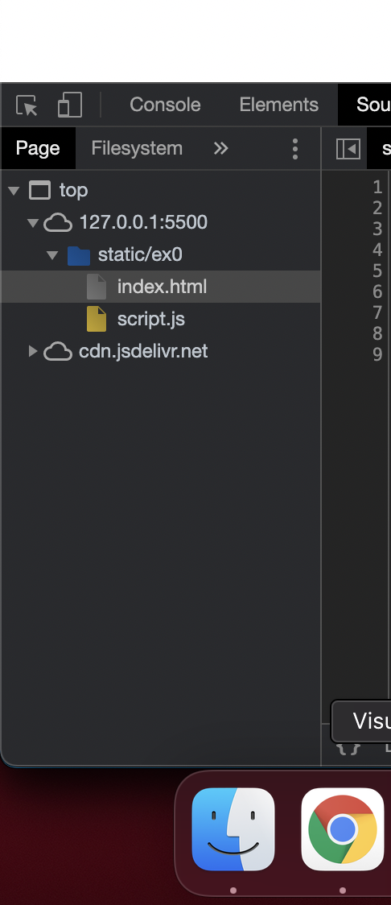
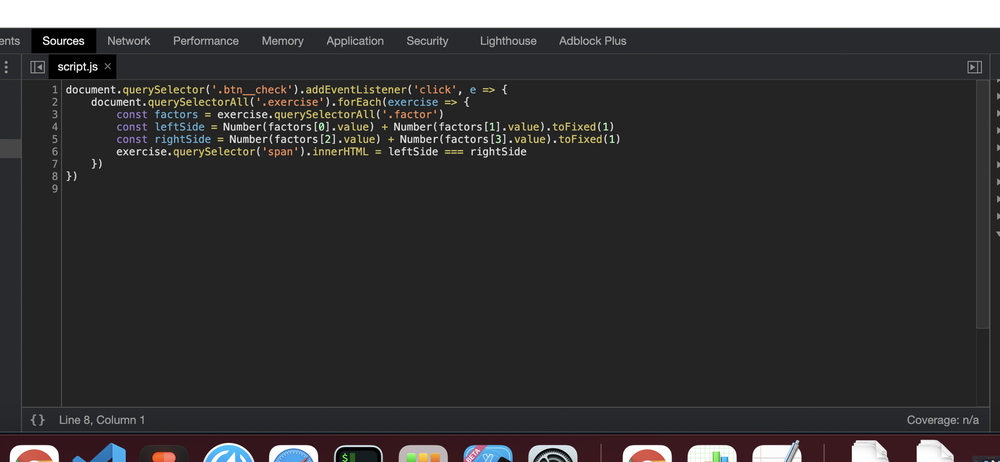
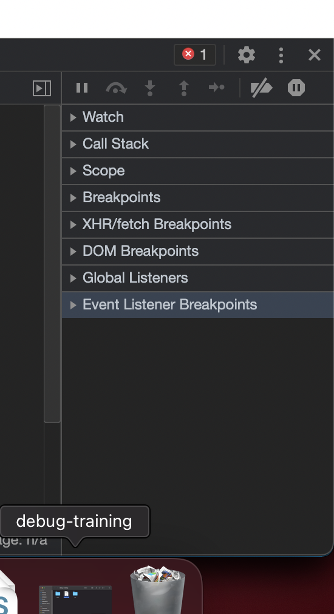
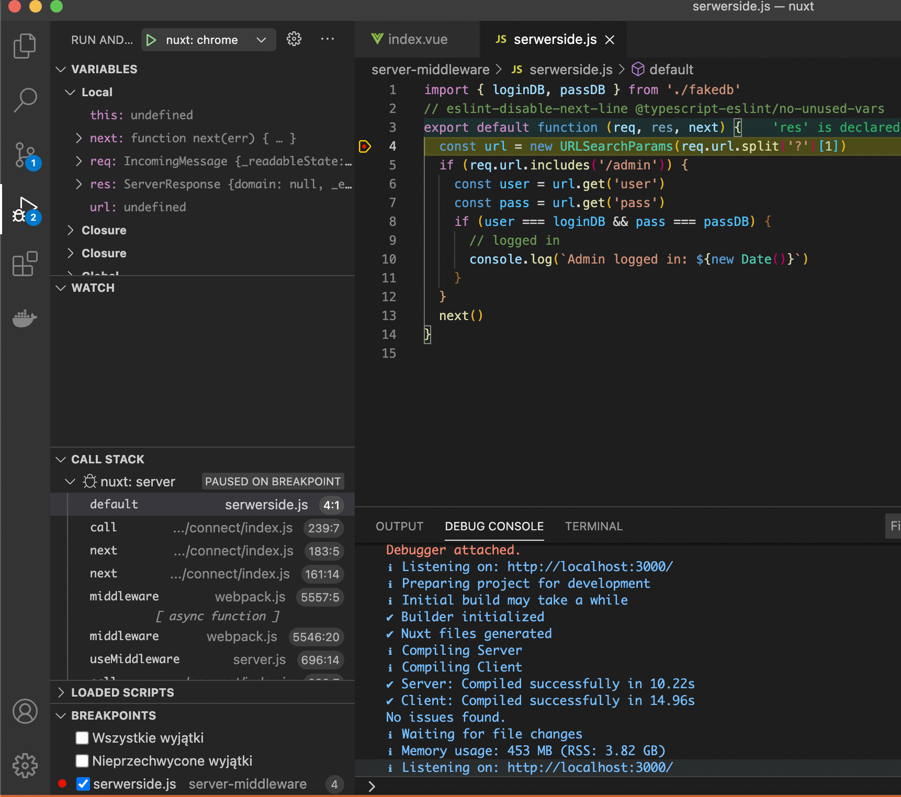

# Debugger (na przykładzie debuggera w Google Chrome).

## Jak dotrzeć do debuggera w przeglądarce
- Dev tools (Option + ⌘ + J na macOS, or Shift + CTRL + J na Windows/Linux)
- Zakładka Sources

## Budowa debuggera w Google Chrome.

### File nawigator
- pokazuje używane zasoby
- pozwala na podgląd każdego z zasobów
- wybrane pliki są możliwe do przeglądania w panelu edytora kodu
- możliwość wczytania workspace'a z plikami (edycja plików panelu edytora kodu pozwala na zapisanie dokonanych zmian bezpośrednio w pliku)



### Code editor
- pozwala na podgląd kodu zasobów
- możliwość podglądu wartości zmiennych po najechaniu myszką
- ustawianie brakpointów / conditional breakpointów przy określonych linijkach kodu (kliknięcie LPM na numerze reprezentującym linijkę kodu, dla dodatkowych opcji jak conditional breakpointy prawym przyciskiem myszy)



## Java script debugging panel
- zarządzanie wykonywaniem kodu
- możliwość zatrzymania wykonywania kodu przy następnej fukcji; wejścia do wnętrza funkcji / wyjścia z obenej funkcji
- możliwość wykowania kodu linijka po linijce
- watch: możliwość zdefiniowania obserwowanych zmiennych
- Call stack: podgląd wszystkich nadrzędnyh funckji, które doprowadziły do wykonania kodu przy obecnym breakpoincie
- Scope: lista wszyskich zmiennych, kontekstów osiągalnych z poziomu obenego breakpintu (podgląd zmiennych lokalnych, globalnych oraz clousure'ów)
- akcywacja / deaktywacja breakpointów poprzez zaznaczenie checkboxa przy nazwie breakpointa
- Breakpoints: lista breakpointów, możliwość aktywowania / wyłączenia breakpointów, możliwość zarządzania breakpointami
- XHR/Fetch breakpoints - zatrzymanie kodu po wykonaniu zapytań na wymieniony url
- DOM Breakpoints: ustawiamy w zakładce Elements na określonym elemencie DOM; kod zostaje zatrzymany przy modyfikacji węzła lub jego podelementów / modyfikacjach atrybutów węzła / usunięciu węzła z DOM
- Event Listener Brakpoints: możliwość zatrzymywania kodu podczas odpalania wybranych eventów DOM, np click
- Pause on exceptions: zatrzymywanie kodu przy błędach / przechwyconych błędach 



## Konsola
- W panelu source można wyświetlić łatwo konsolę (ESC)
- Podczas zatrzymywania kodu na breakpointach w konsoli jest dostępny kontekst wykonywanej linijki kodu
- Daje to możliwość testowania i manipulowania zmiennymi

# Debugger w VS code
- otwieramy przez SHIFT + ⌘ + D (macos) lub klikając charakterystyczną ikonkę z robakiem z poziomu side bara
- brakpointy ustawiamy klikając lewym przyciskiem myszy na numerze linijki kodu
- podobnie jak w przeglądarce mamy mozliwość kontroli dalszego wykonywania kodu poprzez kontrolki pozwające na przeskoczenie do następnego wywałonia fukcji, inspekcję wnętrza fukcji, wyjście z funkcji do nadrzędnego zakresu.
- mozliwość zartrzymywania kodu przy wystąpieniu błędu / obsłuzonego błędu.
- mozliwosc przeglądania call stack'a prowadzącego do wykonania kodu zatrzymanego na danym breakpoincie
- moliwość podglądania wartości zmiennych dostępnych w kontekście wykonywanej linijki kodu
- dostępna jest równiez konsola debuggera, gdzie mozna manipulowac zmiennymi, dokonywac probnych obliczen - kontekst konsoli jest zgodny z kontekstem aktualnie wykonywanej linijki kodu



# Debugger w VS code (Praca z vuejs)
1. Należy skonfigurować webpacka w taki sposób żeby udostępniał nam source mape:
vue.config.js
```js
module.exports = {
  configureWebpack: {
    devtool: 'source-map'
  }
}
```
2. Konfiguracja .vscode/launch.json dla debuggowania SPA Vue w VS code (konfiguracja dla Google Chrome i Firefox'a)
```json
{
  "version": "0.2.0",
  "configurations": [
    {
      "type": "chrome",
      "request": "launch",
      "name": "vuejs: chrome",
      "url": "http://localhost:8080",
      "webRoot": "${workspaceFolder}/src",
      "breakOnLoad": true,
      "sourceMapPathOverrides": {
        "webpack:///src/*": "${webRoot}/*"
      }
    },
    {
      "type": "firefox",
      "request": "launch",
      "name": "vuejs: firefox",
      "url": "http://localhost:8080",
      "webRoot": "${workspaceFolder}/src",
      "pathMappings": [{ "url": "webpack:///src/", "path": "${webRoot}/" }]
    }
  ]
}
```
3. Po dokonaniu powyzszej konfiguracji, mozna ustawiac breakpointy bezposrednio w VS code - klikając na numer linijki kodu w miejscu gdzie chcemy zatrzymać wykonywanie kodu.
4. Podczas zatrzymania kodu na określonych breakpointach mozna manipulować zmiennymi, prowadzić obliczenia itp. pozostając w kontekście linijki kodu w której się znajdujemy poprzez konsolę debuggera.

# Debugger w VS code (Praca z nuxt)
1. Najwazniejszą sprawą podczas uzywania debuggera jest określenie w jakim kontekście chcemy debuggować naszą aplikację. Stawaijąc breakpointy nalezy mieć zawszę na uwadze czy chcemy debuggować kod wykonywany po stronie servera czy clienta.

2. W pliku konfiguracyjnym nuxt.config.js nalezy dodać ponizszy zapis zeby udostepniac odpowiednie source mapy dla debuggowania w zalenosci od środowiska (client side/server side)

nuxt.config.js
```js
build: {
  extend(config, ctx) {
    if (ctx.isDev) {
      config.devtool = ctx.isClient ? 'source-map' : 'inline-source-map'
    }
  },
}
```

3. Konfiguracja .vscode/launch.json dla debuggowania Nuxta (config dla debuggowania po stronie servera i clienta)

```json
{
  "version": "1.0.0",
  "configurations": [
    {
      "type": "chrome",
      "request": "launch",
      "name": "nuxt: chrome",
      "webRoot": "${workspaceFolder}",
      "sourceMapPathOverrides": {
        "webpack:///*": "${workspaceRoot}/*"
      },
      "url": "http://localhost:3000",
      "breakOnLoad": true
    },
    {
      "type": "node",
      "request": "launch",
      "name": "nuxt: server",
      "args": ["dev"],
      "outputCapture": "std",
      "osx": {
        "program": "${workspaceFolder}/node_modules/.bin/nuxt"
      },
      "linux": {
        "program": "${workspaceFolder}/node_modules/.bin/nuxt"
      },
      "windows": {
        "program": "${workspaceFolder}/node_modules/nuxt/bin/nuxt.js"
      }
    }
  ]
}
```
3. Odpalając debuggera nalezy wybrac z listy dostępnych konfiguracji w debuggerze VS code konfigurację "nuxt: server" i włączyć ją klikając ikonkę play. Konfigurację debuggowania dla client side nalezy wlaczyc w drugiej kolejności, kiedy kofiguracja server side rozpocznie budowanie aplikacji nuxt.
4. Po dokonaniu powyzszej konfiguracji, mozna ustawiac breakpointy bezposrednio w VS code - klikając na numer linijki kodu w miejscu gdzie chcemy zatrzymać wykonywanie kodu.
5. Podczas zatrzymania kodu na określonych breakpointach mozna manipulować zmiennymi, prowadzić obliczenia itp. pozostając w kontekście linijki kodu w której się znajdujemy poprzez konsolę debuggera.

# Tipy:
1. Debuggując aplikacje vue/nuxt za pomocą debuggera w przeglądarce internetowej praca z breakpointami reagującymi na zdarzenia DOM jest wygodniejsza gdy dodajemy boilerplate biblioteki do igore listy.
2. Chcąc łatwo otworzyć podgląd pliku związanego z source mapą mozna uzyc skrótu ( ⌘ + O na macOS, CTRL + O na Windows/Linux)

https://vuejs.org/v2/cookbook/debugging-in-vscode.html  
https://developer.mozilla.org/en-US/docs/Tools/Debugger/How_to/Use_a_source_map  
https://code.visualstudio.com/docs/editor/debugging  